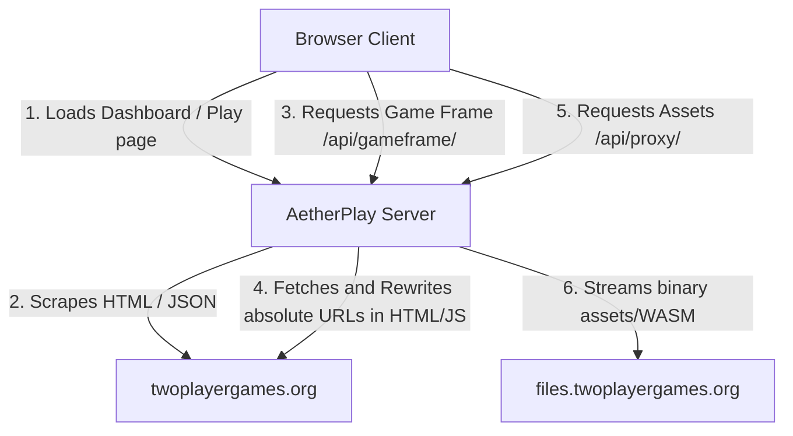

# AetherPlay - Unblocked Two Player Games Mirror

AetherPlay is a modern, high-performance, and visually stunning web platform designed to mirror and proxy games from [TwoPlayerGames](https://www.twoplayergames.org/) to enable access on restricted networks, such as school or corporate WiFi.

Built with **Next.js (App Router)** and stylized using **Vanilla CSS** with a premium dark neon theme, the platform dynamically fetches and proxies games, gameframes, scripts, styles, and asset files to ensure **zero network request leakage** to the original domains.

---

## Key Features

1. **100% Proxied Connections**: All HTML, JavaScript, WASM, WebGL, CSS, and image assets are fetched by our server and served directly under the platform's origin. Filters only see requests to this domain.
2. **WebGL Audio/Video Stream Support**: Integrates full HTTP Range requests in the asset proxy, resolving issues where game audio or video loops fail to load in Safari and Chrome.
3. **Premium Visual Design**: Dark neon design system implementing CSS-custom properties, glassmorphism (`backdrop-filter`), smooth hover scaling, and full responsive layouts.
4. **My Game Box (Favorites)**: Access a stateful favorite-management screen powered by client-side `localStorage`.
5. **Universal Search & Categories**: Seamlessly searches the entire catalog and parses categories (Sports, Action, Racing, Zombies, etc.) dynamically.

---

## Technical Architecture

The platform operates using a server-side gateway to isolate client browsers from blocked hosts:



- **API Endpoints**:
  - `/api/games`: Dynamic scraping of lists and categories.
  - `/api/search`: Translates searches into local endpoints.
  - `/api/gameframe/[slug]`: Mirrors gameframes, stripping frame-breakers and rewriting origins.
  - `/api/proxy/[...path]`: Mirrors binary assets and rewrites absolute CDN domains inside text assets.
  - `/api/proxy-dist/[...path]`: Mirrors dist scripts/stylesheets from the original site.
  - `/api/proxy-images/[...path]`: Mirrors static thumbnail images.

---

## Getting Started

### Prerequisites

- Node.js (v18+)
- npm

### Installation

1. Install dependencies:
   ```bash
   npm install
   ```

2. Start the development server:
   ```bash
   npm run dev
   ```

3. Open your browser and navigate to `http://localhost:3000`.

---

## Verification & E2E Testing

We use **Playwright** to ensure that no network leaks occur. The test suite intercepts all outgoing requests from the page and its iframes, throwing an error if any connection attempts are made directly to `twoplayergames.org` or its subdomains.

### Run Tests

1. Install Playwright browsers:
   ```bash
   npx playwright install chromium
   ```

2. Run the test suite:
   ```bash
   npx playwright test
   ```

All tests, including the zero-leak network check, should pass:
```bash
Running 5 tests using 1 worker

  ✓  should load homepage and display game grid (639ms)
  ✓  should filter games by category (657ms)
  ✓  should search for games and show results (721ms)
  ✓  should play a game and verify proxy embedding with no leaks (885ms)
  ✓  should add a game to Favorites (Game Box) and retrieve it (569ms)

  5 passed (5.0s)
```
